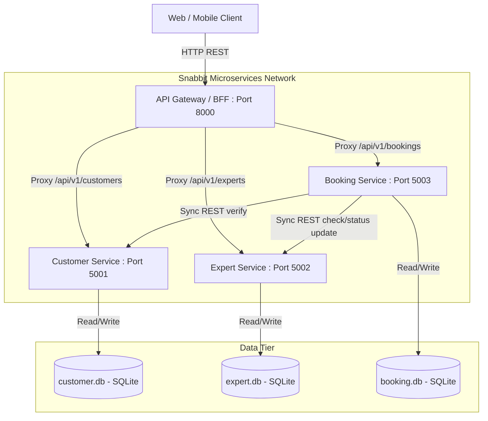

# BITS Pilani: Microservices Architecture & Design (Assignment 1)
## Course Assignment Report: Snabbit On-Demand Home Services Application

---

### A. Team Details & Contributions

| BITS ID | Student Name | Role / Key Contributions |
| --- | --- | --- |
| **2024SI96552** | Ankita Pihulkar | Service Boundaries & DDD Decomposition, Customer Service development, Database strategy selection, Docker Compose configurations, API Versioning design, PowerShell integration tests. |
| **2024SI96517** | Praharaj Tripathy | Expert Service registry design, SQLite database schemas, API Gateway setup. |
| **2024SI96539** | Sufiya Ikhlas | Booking Service orchestration, Axios request chains, Dockerfile creation. |

---

### B. Application Overview (Snabbit Platform)

**Snabbit** is a 10-minute on-demand home services application focusing on providing quick, reliable, and verified female house help (Experts) to users. The platform allows modern urban households to hire professionals for immediate short-term tasks on an hourly basis, such as kitchen cleaning, dishwashing, fan/window cleaning, laundry, and bathroom cleaning. 

Rather than requiring monthly contracts or commitments, Snabbit runs a real-time matching market matching available background-checked, Aadhaar-verified Experts with customers.

---

### C. System Architecture & Service Decomposition

#### Architectural Overview

The application is designed using a cloud-native Microservices Architecture utilizing the **Database-per-Microservice** pattern. The entry point of all client traffic is the **API Gateway / BFF**, which acts as a reverse proxy, aggregates APIs, and performs API composition.



#### Service Decomposition Rationale
We utilized **Decomposition by Sub-Domain (Domain-Driven Design - DDD)** to separate concerns and enforce Single Responsibility:

1. **Customer Service (Core Domain)**: Responsible for Customer registration, identity, and location profiles. Changes to user profiles or addresses only impact this service.
2. **Expert Service (Core Domain)**: Responsible for professional help registry, Aadhaar verification state, current service location, skills listing, and availability status (e.g. `available`, `busy`).
3. **Booking Service (Supporting Domain)**: Responsible for orchestrating the service transaction lifecycle. It manages booking statuses (assigned, in_progress, completed) and handles calculations of service durations and costs.

---

### D. Service API Design & Collaborations

The services expose RESTful interfaces and communicate synchronously via HTTP. 

#### 1. Customer Service APIs
- **Create Customer** (Command)
  - `POST /v1/customers`
  - Request Payload:
    ```json
    { "name": "Shreyash", "email": "shreyash@bits.edu.in", "phone": "9999999999", "address": "Flat 302, Phase 1, Bangalore" }
    ```
  - Response: `201 Created` with created customer details and generated `id`.
- **Get Customer Profile** (Query)
  - `GET /v1/customers/:id`
  - Response: `200 OK` with customer profile object.
- **List All Customers** (Query)
  - `GET /v1/customers`

#### 2. Expert Service APIs
- **Register Expert** (Command)
  - `POST /v1/experts`
  - Request Payload:
    ```json
    { "name": "Priya Sharma", "phone": "9876543210", "skills": "kitchen cleaning,dishwashing", "aadhaar": "123456789012", "hourly_rate": 150, "city": "Mumbai" }
    ```
  - Response: `201 Created` with Expert profile details.
- **Update Status** (Command)
  - `PUT /v1/experts/:id/status`
  - Request Payload: `{ "status": "busy" }` or `{ "status": "available" }`
- **Filter Available Experts** (Query)
  - `GET /v1/experts?city=Mumbai&status=available&skill=dishwashing`

#### 3. Booking Service APIs
- **Create Booking** (Command - Orchestrates Customer & Expert checks)
  - `POST /v1/bookings`
  - Request Payload:
    ```json
    { "customer_id": 1, "expert_id": 1, "service_type": "kitchen cleaning", "duration_hours": 2, "booking_date": "2026-07-20" }
    ```
  - Behavior: Verifies customer exists, checks if expert is available and matches skills, sets expert status to `busy`, calculates total cost, and logs booking.
- **Update Booking Status** (Command)
  - `PUT /v1/bookings/:id/status`
  - Request Payload: `{ "status": "completed" }`
  - Behavior: If status is updated to `completed` or `cancelled`, the Booking Service calls Expert Service to release the expert back to `available`.

#### 4. API Gateway / BFF APIs
- **Gateway Routing**:
  - `GET/POST /api/v1/customers/*` -> Proxied directly to Customer Service.
  - `GET/POST/PUT /api/v1/experts/*` -> Proxied directly to Expert Service.
  - `GET/POST/PUT /api/v1/bookings/*` -> Proxied directly to Booking Service.
- **API Composition** (Query):
  - `GET /api/v1/bookings/:id/detail`
  - Behavior: Gateway calls Booking Service, fetches customer details using `customer_id`, fetches expert details using `expert_id` concurrently, aggregates the JSON, and returns a unified detailed view of the booking to the client.

---

### E. Database Strategy & Patterns

#### Database-per-Microservice
To prevent database coupling and ensure independent deployability, each microservice owns its schema and data store:
*   `customer-service` owns `customer.db` (SQLite)
*   `expert-service` owns `expert.db` (SQLite)
*   `booking-service` owns `booking.db` (SQLite)

No service is allowed to read or write directly to another service's database. Data interaction happens strictly through API boundaries.

#### Advanced Patterns (Conceptual Application)
*   **Saga Pattern (Orchestration-based)**: When a booking is created, the Booking Service coordinates a local transaction. It verifies parameters, issues a command to set the Expert status to `busy`, and records the booking. If the booking insertion fails, a compensating transaction is executed to revert the Expert status back to `available`.
*   **CQRS (Command Query Responsibility Segregation)**: Direct command writes modify state in the Booking/Expert databases. The API Gateway composition endpoint implements a Query model by reading from multiple microservices and consolidating them on-the-fly, reducing the load on individual transactional models.

---

### F. Inter-Service Communication Design

*   **Communication Type**: Synchronous request-response using HTTP REST (via `axios` library).
*   **Decoupling Strategy**: While communication is synchronous, services are decoupled by relying on service host discovery (DNS naming in Docker network e.g., `http://customer-service:5001`). Services communicate via logical URIs rather than static IP addresses.
*   **Failure Isolation**: If the `expert-service` is down, the booking service catches the connection error and returns a clean `502 Bad Gateway` status to the client, preventing database corruption and ensuring partial availability (customers can still read profiles or view history).

---

### G. API Versioning Strategy

To support gradual upgrades and prevent breaking changes for existing consumers, we implement **URI API Versioning**:
*   All endpoints are prefixed with `/v1/` (internal services) and `/api/v1/` (API Gateway).
*   **Breaking Changes** (e.g., deleting a field from payload, renaming parameters) will necessitate incrementing the URI to `/api/v2/`.
*   **Non-Breaking Changes** (e.g., adding an optional field to response) will be communicated via release notes and do not trigger version increment.
*   We use **Semantic Versioning (SemVer)** for microservice deployment tags (e.g., `v1.0.0` for release, incrementing patches for bug fixes and minor version for new backward-compatible features).

---

### H. Containerization & Deployment Steps

Each service includes a lightweight `Dockerfile` based on `node:18-alpine`. Orchestration is done using `docker-compose`.

#### 1. How to Build & Start the Application
Make sure you have Docker Desktop installed, then open a terminal in the root directory of the application:

```bash
# Build the microservices containers
docker-compose build

# Start the application in detached mode
docker-compose up -d

# Verify all services are running
docker-compose ps
```

#### 2. Verify Services are Running (Health Checks)
```bash
curl http://localhost:8000/health
curl http://localhost:5001/health
curl http://localhost:5002/health
curl http://localhost:5003/health
```

---

### I. Step-by-Step Test Guide (for Demo Videos)

Use the following `curl` script commands to demonstrate the working microservice application for your video.

#### Step 1: Create a Customer
Create a new customer profile through the API Gateway:
```bash
curl -X POST http://localhost:8000/api/v1/customers \
  -H "Content-Type: application/json" \
  -d '{"name": "Shreyash", "email": "shreyash@bits.edu.in", "phone": "9999999999", "address": "Flat 302, Phase 1, Bangalore"}'
```
*Expected Output: Customer created with `id: 1`.*

#### Step 2: Query Available Experts
Query the available experts in Mumbai who can perform "kitchen cleaning":
```bash
curl "http://localhost:8000/api/v1/experts?city=Mumbai&status=available&skill=kitchen"
```
*Expected Output: Details of Priya Sharma (Expert ID 1, rate: 150/hr).*

#### Step 3: Create a Booking (Orchestration & Inter-service Communication)
Book Expert ID 1 for Customer ID 1 for 3 hours:
```bash
curl -X POST http://localhost:8000/api/v1/bookings \
  -H "Content-Type: application/json" \
  -d '{"customer_id": 1, "expert_id": 1, "service_type": "kitchen cleaning", "duration_hours": 3, "booking_date": "2026-07-20"}'
```
*Expected Output: Booking created, calculating total cost as 450 (150 * 3).*

#### Step 4: Verify Expert Status has Changed to Busy
Check that the expert's status was updated to `busy` by the booking transaction:
```bash
curl http://localhost:8000/api/v1/experts/1
```
*Expected Output: Expert Priya Sharma status is "busy".*

#### Step 5: Test API Composition on Gateway
Fetch the complete booking detail package:
```bash
curl http://localhost:8000/api/v1/bookings/1/detail
```
*Expected Output: Combined JSON payload showing full booking data, customer profile, and expert profile.*

#### Step 6: Complete the Booking and Release the Expert
Mark the booking as completed, releasing the expert:
```bash
curl -X PUT http://localhost:8000/api/v1/bookings/1/status \
  -H "Content-Type: application/json" \
  -d '{"status": "completed"}'
```
*Verify that the expert is available again:*
```bash
curl http://localhost:8000/api/v1/experts/1
```
*Expected Output: Expert Priya Sharma status is "available".*

---

### J. Scaling & Fault Isolation (Demo Video 3)

#### Scaling Services
You can scale individual microservices independently (e.g. scale the Customer Service to 3 instances) using Docker Compose:
```bash
docker-compose up -d --scale customer-service=3
```

#### Fault Isolation
To demonstrate fault isolation in your video:
1. Stop the Expert Service container:
   ```bash
   docker-compose stop expert-service
   ```
2. Call the Customer endpoint. Notice it still works since services are independent:
   ```bash
   curl http://localhost:8000/api/v1/customers/1
   ```
3. Attempt to make a new booking. Notice the booking service returns a controlled failure response without crashing:
   ```bash
   curl -X POST http://localhost:8000/api/v1/bookings ...
   ```
   *Output: Error message showing failed to contact Expert Service.*

---

### K. Demo Video Guide & Scripts

To help you record the three required demo videos, here are structured scripts and checklists:

#### Demo Video 1: Architecture & Rationale (Duration: 2-3 mins)
*   **Visual**: Show the Mermaid architecture diagram from this report.
*   **Script / What to Say**:
    > "Hello, we are group [IDs]. Today we present our microservice design for Snabbit, a 10-minute on-demand female house help application. We have decomposed our application into three distinct services: Customer Service, Expert Service, and Booking Service.
    > 
    > Each service has a Single Responsibility. Customer Service manages customer registration and addresses. Expert Service manages the helper profiles, ratings, and active statuses. Booking Service orchestrates the transactions. 
    > 
    > We utilize the Database-per-Microservice pattern with SQLite databases. This ensures that no service can query another's database directly, preventing coupling. Services communicate synchronously via REST APIs, discoverable by their service names on our Docker network."

#### Demo Video 2: Live Execution & Gateway Routing (Duration: 3-5 mins)
*   **Visual**: Show your terminal and Docker Desktop.
*   **Script / What to Say**:
    > "Now we show our services running. By executing `docker-compose up -d`, Docker builds and launches four containers: our three core services and our API Gateway. 
    > 
    > We will execute our test script `.\test_apis.ps1`. Watch as we create a new customer and query available experts in Mumbai. The Gateway routes these requests using `/api/v1/` prefixes, enforcing URI-based versioning. 
    > 
    > When we create a booking, the Booking Service calls the Customer and Expert services synchronously to check availability, locks the expert's status to 'busy', and saves the record. 
    > 
    > When calling the gateway `/bookings/1/detail` endpoint, the API Gateway performs API Composition—fetching the booking, customer, and expert details concurrently and merging them into one response. When we complete the booking, the expert is released back to 'available'."

#### Demo Video 3: Scalability & Fault Isolation (Duration: 2-3 mins)
*   **Visual**: Terminal showing compose commands.
*   **Script / What to Say**:
    > "In this final demo, we show the reliability of our system. First, we scale the Customer Service using: `docker-compose up -d --scale customer-service=3`. Docker compose spins up two additional instances.
    > 
    > Next, we demonstrate fault isolation. We stop the Expert Service using `docker-compose stop expert-service`. While the expert registry is down, our Customer Service is still fully accessible on the gateway, showing partial availability. 
    > 
    > If we attempt to create a booking, the Booking Service fails gracefully, returning a controlled error instead of crashing. This proves that our microservices boundary protects system availability."

---

### L. Packaging Your Submission

To create the final ZIP submission file:
1. Open PowerShell in the project directory.
2. Run the packaging helper script:
   ```powershell
   .\package_submission.ps1
   ```
3. Enter your team members' BITS IDs when prompted.
4. The script will bundle all code folders, `docker-compose.yml`, `README.md`, and a rendered HTML copy of the documentation into a zip file named `<BITS_IDs>_snabbit.zip` and place it directly in your **Downloads** folder.

